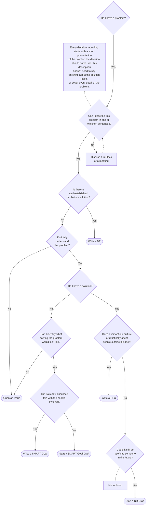

# Blindnet Decision Framework

## Definition

At blindnet, we clearly distinguish _"choices"_ from _"decisions"_.

A **_decision_** is a conclusion or a resolution taken after **collective** examination and which commits us as a group.

A **_choice_** is a conclusion or a resolution someone took individually, therefore binding only the person who has taken it. This framework doesn't say how you should make a choice, as they only apply to you. Never hesitate to make choices, but don't expect others to follow them. If you want people to follow a choice you made, make it a decision.

## Guiding Principles

1. Some decisions need to be made quickly. Do not get attached to those.
2. Unrecorded decisions aren't _important_ decisions. [Record](#recording-decisions) all _important_ decisions to ensure everyone can understand, assimilate and challenge them.
3. No decision is fixed in stone. Decisions can't last without being openly, thoroughly, and repeatedly challenged. Decisions Records have to be updated accordingly.

 

---

 

# Recording Decisions

## Why should you record decisions?

1. provide a comprehensive set of information that allows all stakeholders (past, present, and future) to have a shared understanding of important facts and information about a given problem, project, or decision
2. collectively discuss and challenge ideas to improve their quality

## Where will you publish?

You can add decision recording to a repository by copying [templates/decisions/](./templates/decisions/) to a `docs/` folder or root directory and then updating the `README.md` file.

However, information dispersion across projects should be avoided as much as possible.
For most cases, the pre-existing following repositories will be a much better option:

<!-- prettier-ignore -->
| access  | project | scope |
| ------- | ------- | ----- |
| public  | [blindnet-io/blindnet-docs](https://github.com/blindnet-io/blindnet-docs) | developer portal ([docs.blindnet.io](https://docs.blindnet.io/)) |
| public  | [blindnet-io/openness-framework](https://github.com/blindnet-io/openness-framework) | Blindnet Openness Framework and documentation |
| public  | [blindnet-io/devrel-management](https://github.com/blindnet-io/devrel-management) | management of developer relations matters |
| public  | [blindnet-io/product-management](https://github.com/blindnet-io/product-management) | feedback and evolution tracking by and for blindnet team members |
| private | [blindnet-io/clients-management](https://github.com/blindnet-io/clients-management) | restricted information related to our prospects and clients |
| private | [blindnet-io/communication-management](https://github.com/blindnet-io/communication-management) | restricted communication related information |

Public repositories should always be favored over private repositories in respect of our [information classification policy](../information-classification.md).

## How will you write and publish?

1. [Identify](#questions-to-ask-yourself) which [document type](#document-types) best match your need
1. Copy and paste the associated template file in the appropriate project's directory
    - Note that you can also just copy and paste the template's content to create a Github issue
    - Just try to follow the instructions/conventions of the associated project. Some even provide issue templates to ease the process.
1. Fill out all applicable fields.
1. Send a Pull Request
1. Use collaboration and feedback features to support your decision-making process (e.g. comments, reviews, polls).

### Make It Comprehensive, Yet Consumable

Do not hesitate to join any useful file to ease comprehension and discussion.

Just make sure to use the [inverted pyramid](https://www.s8080.com/blog-news/writing-detail-pages-information-pages) method to organize content clearly and efficiently

## What template will you use?

We distinguish three types of documents with associated [templates](./templates/): DRs (_Decision Records_), SGs (_SMART Goals_) and RFCs (_Request For Comments_)

### Decision Records

Record simple decisions which don't require extensive discussions or have already been discussed elsewhere.

Use [`DR-XXXX-template.md`](./templates/DR-XXXX-template.md), a simpler, straightforward, and generic "Decision Record" template. It's the most obvious choice to record a simple decision, especially if it's closed to be made or was already made.

### SMART Goals

Propose and set a clear collective goal.

Use [`SG-XXXX-template.md`](./templates/SG-XXXX-template.md) to clearly think and describe an objective to be met following the SMART goal method; It's often the better choice at an early stage of a reflection to specify an overriding objective before building a project around it.

### Request For Comments

Kick-start a discussion on a complexe solution to an high impact problem.

To paraphrase [Steve Crocker](https://www.wired.com/2012/05/steve-crocker/), RFCs are completely informal and don't really count as "decision recording" per se. You can ask questions without answers. You just need to put your name and the date and a title on these things, and we'd assign them a number and try to find you an appropriate sponsor as fast as you wrote them.

Use [`RFC-XXXX-template.md`](./templates/RFC-XXXX-template.md) to help you better describe and thorougly think the problem and the solution you propose. Customize as needed. Delete the tops, unused sections, etc.

## Who will be able to view this and other documents?

- At blindnet, we [default to open](../information-classification.md). If there's no good reason to restrict access, we try to make it visible to everyone.
- Make sure all parties involved in the addressed topic are comfortable with this. Discuss the risks and benefits whenever needed.
- A few sensitive projects may require to be started with restricted access. Consider slowly opening access in concentric circles.
- If a project is "sensitive" simply because people may react negatively, you can build trust and respect (and [give people time to navigate the grief curve](http://www.whatnextconsultancy.co.uk/blog/managing-change-change-curve.aspx)) by being open from the start.

## When should you record a decision?

1. All decisions impacting staff members and the community in the long term should be recorded.
1. All recorded decisions have to be linked to a problem they solve. If you can't clearly state this problem, you can't record a decision.
1. If the decision won't last more than a few weeks, you don't need to record it using one of our templates. You can just open an issue or write an informal note instead for more efficiency.
1. Never hesistate to share! If you identified a problem, but aren't sure about the solution or how to address it, just write a draft to start the discussion (i.e. put what little following the most appropriate template, and create a [Pull Request](https://docs.github.com/en/pull-requests/collaborating-with-pull-requests/proposing-changes-to-your-work-with-pull-requests/about-pull-requests)).

### Questions to ask yourself

As any documentation, recording a decision takes time and efforts.
Try to see if recording the decision would have a good enough "ROI" for yourself and the community by asking:

- Would explaining the decision again and again take less time than recording and constantly updating it?
- Is there a better context or form for this kind of documentation/discussion (e.g. issue,  technical specification, mockup, or even some bullet points or diagram)?
- How long will it last? Could this topic be soon outdated?
- Does it impact enough people?

Additionnally, you can refer to the following flowchart to help you better decide when and how to record something:

### Recording a Decision in This Project

Generic decisions impacting our Openness Framework should be recorded in the [`docs/`](../docs/) directory of this repository.
