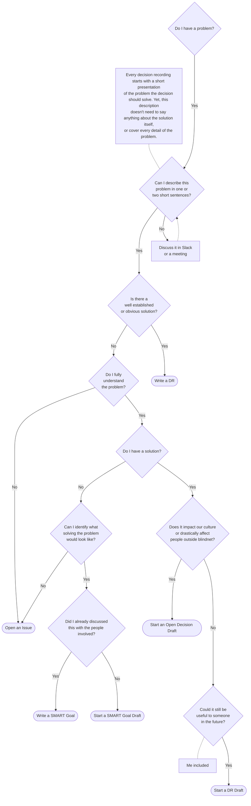

# Blindnet Decision Framework

## What Deciding Means to Us

### Definition

At blindnet, we clearly distinguish _"choices"_ from _"decisions"_.

A **_decision_** is a conclusion or a resolution taken after **collective** examination and which commits us as a group.

A **_choice_** is a conclusion or a resolution someone took individually, therefore binding only the person who has taken it. This framework doesn't say how you should make a choice, as they only apply to you. Never hesitate to make choices, but don't expect others to follow them. If you want people to follow a choice you made, make it a decision.

### Guiding Principles

1. Some decisions need to be made quickly. [Do not get attached to those](./shifting-priorities.md).
2. Unrecorded decisions aren't _important_ decisions. [Record](#recording-decisions) all _important_ decisions to ensure everyone can understand, assimilate and challenge them.
3. No decision is fixed in stone. Decisions can't last without being openly, thoroughly, and repeatedly challenged. Decisions Records have to be updated accordingly.

## Recording Decisions

All important decisions have to be recorded in a Common Fact Base.

We distinguish three types of documents:

- **SMART Goals**, to propose and set a clear collective goal
- **Decision Records**, to record simple decisions which don't require extensive discussions or have already been discussed elsewhere
- **[Open Decisions](./OPEN-DECISIONS.md)**, to collectively find a solution to a complex problem that could impact our culture or drastically affect people outside blindnet

This framework provides a [CFB seed project](./CFB-seed/) with templates to ease and guide decision recording.

### Recording a Decision in This Project

Generic decisions impacting the whole organization should be recorded in this directory (i.e. the "Global Blindnet Open CFB").

Simple decisions can be recorded in a unique document. Just copy the most relevant template, edit its content, and make a pull request to discuss it with all stakeholders.

More complex decisions may need several documents. When this is the case, create a directory, and follow the [inverted pyramid](https://www.s8080.com/blog-news/writing-detail-pages-information-pages) method.

### When Should I Record a Decision?

1. All decisions impacting staff members and the community in the long term should be recorded.
1. All recorded decisions have to be linked to a problem they solve. If you can't clearly state this problem, you can't record a decision.
1. If the decision won't last more than a few weeks, you don't need to record it using one of our templates. You can just open an issue or write an informal note instead for more efficiency.
1. Never hesistate to share! If you identified a problem, but aren't sure about the solution or how to address it, just write a draft to start the discussion (i.e. put what little following the most appropriate template, and create a [Pull Request](https://docs.github.com/en/pull-requests/collaborating-with-pull-requests/proposing-changes-to-your-work-with-pull-requests/about-pull-requests)).

#### Questions to ask yourself

As any documentation, recording a decision takes time and efforts.
Try to see if recording the decision would have a good enough "ROI" for yourself and the community by asking:

- Would explaining the decision again and again take less time than recording and constantly updating it?
- Is there a better context or form for this kind of documentation/discussion (e.g. issue,  technical specification, mockup, or even some bullet points or diagram)?
- How long will it last? Could this topic be soon outdated?
- Does it impact enough people?

Additionnally, you can refer to the following flowchart to help you better decide when and how to record something:

