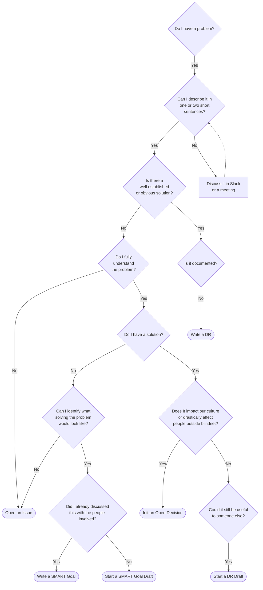

# Blindnet Decision Framework

## What Deciding Means to Us

### Definition

At blindnet, we clearly distinguish _"choices"_ from _"decisions"_.

A **_decision_** is a conclusion or a resolution taken after **collective** examination and which commits us as a group.

A **_choice_** is a conclusion or a resolution someone took individually, therefore binding only the person who has taken it. This framework doesn't say how you should make a choice, as they only apply to you. Never hesitate to make choices, but don't expect others to follow them. If you want people to follow a choice you made, make it a decision.

### Guiding Principles

1. Some decisions need to be made quickly. [Do not get attached to those](./shifting-priorities.md).
2. Unrecorded decisions aren't _important_ decisions. [Record](#recording-decisions) all _important_ decisions to ensure everyone can understand, assimilate and challenge them.
   - **_corollary_**: all decisions aren't _important_ decisions. You don't need to record decisions with no significant effects or minimal long-term impact.
3. No decision is fixed in stone. Decisions can't last without being openly, thoroughly, and repeatedly challenged. Decisions Records have to be updated accordingly.

## Recording Decisions

All important decisions have to be recorded in a Common Fact Base.

We distinguish three types of documents:

- **SMART Goals**, to propose and set a clear collective goal
- **Decision Records**, to record simple decisions which don't require extensive discussions or have already been discussed elsewhere
- **[Open Decisions](./OPEN-DECISIONS.md)**, to collectively find a solution to a complex problem that could impact our culture or drastically affect people outside blindnet

This framework provides a [CFB seed project](./CFB-seed/) with templates to ease and guide decision recording.

### Recording a Decision in This Project

Generic decisions impacting the whole organization should be recorded in this directory (i.e. the "Global Blindnet Open CFB").

Simple decisions can be recorded in a unique document. Just copy the most relevant template, edit its content, and make a pull request to discuss it with all stakeholders.

More complex decisions may need several documents. When this is the case, create a directory, and follow the [inverted pyramid](https://www.s8080.com/blog-news/writing-detail-pages-information-pages) method.

### What Should I do?

> :warning: **Never hesitate to share, but don't waste your time!**
>
> First, make sure the decision could impact someone else in a significant enough matter.
>
> After that, remember that recording a decision isn't about saying _"hey, I made this choice, do you agree"_.
> Share your thoughts, make people challenge them, and reach a satisfying solution collectively.
>
> Don't try to get everything right directly. Open a [Pull Request](https://docs.github.com/en/pull-requests/collaborating-with-pull-requests/proposing-changes-to-your-work-with-pull-requests/about-pull-requests) as soon as you've found a clear enough description for the problem, even if the document is only an early draft.

> Flowchart inspired by "[When Should I Write an Architecture Decision Record](https://engineering.atspotify.com/2020/04/when-should-i-write-an-architecture-decision-record/)" by Josef Blake.
