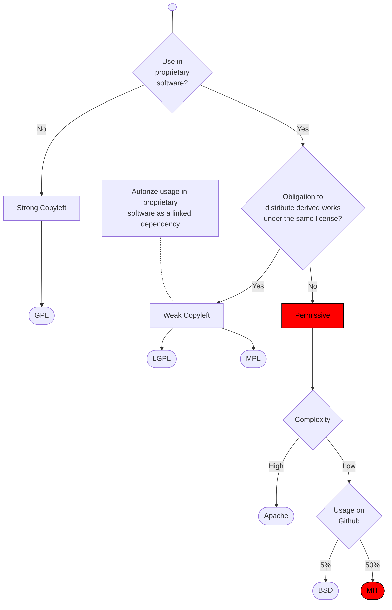

# Choose by default license(s) for Open Source projects

| Status      | proposed                                            |
| :---------- | :-------------------------------------------------- |
| **PR #**    | [7](https://github.com/blindnet-io/openness/pull/7) |
| **Sponsor** | Noël Macé (noel@blindnet.io)                        |

## Context and Problem Statement

As blindnet [decided](https://github.com/blindnet-io/devrel-planning/issues/49) to fully embrace Openness principles and Open Source in particular, what license(s) should be used for Open Source projects?

## Decision Drivers <!-- optional -->

* low impact on adoption (usage in proprietary software)
* low barrier to entry for contributors
* global adoption

## Considered Options

* GPL (v2 or v3)
* LGPL (v2.1 or v3)
* Apache
* BSD
* MIT

## Decision Outcome

Chosen option: "MIT", because it's the most widely adopted simple permissive license (see below).

### Positive Consequences

* really easy to implement and follow

### Negative Consequences

* may leave room for possibly unanticipated legal problems (should be checked with a legal professional later on)

## Decision process

> In the current context, our tools and libraries are highly susceptible to be used in proprietary software. Adoption is our primary goal, and we don't fear "proprietary forks" as we're in a phase of active and constant innovation. Consequently, we'll only consider permissive licenses, as opting for a copyleft license could have a negative impact on adoption.

## Pros and Cons of the Options

### Strong Copyleft (GPL)

A license with strong copyleft (like GPL) requires all modified and extended versions of the program to be free as well.

See [GPL Copyleft](https://en.wikipedia.org/wiki/GNU_General_Public_License#Copyleft), [GPLv3 license](https://www.gnu.org/licenses/gpl-3.0.html), ["Why you shouldn't use the Lesser GPL for your next library"](https://www.gnu.org/licenses/why-not-lgpl.en.html) and the [GPLv3 quick guide](https://www.gnu.org/licenses/quick-guide-gplv3.html)

* Good, because popular and well-known
* Bad, because would forbid to use our libraries in proprietary software, which would have a too negative impact on adoption

### Dual-licensing (GPL + Proprietary/OEM)

> i.e. using a license with strong copyleft like GPL, plus a "pay-for" proprietary OEM-style license specifically for usage in proprietary software

See ["Dual Licensing for Open Source Components: Yeah or Meh?"](https://www.whitesourcesoftware.com/resources/blog/dual-licensing-for-open-source-components/) and [Multi-licensing](https://en.wikipedia.org/wiki/Multi-licensing)

* Good, because could offer a complementary source of revenue
* Good, because covers all use-cases
* Bad/Postponed, because would require help from legal professionals, as it is highly complex to define
* Bad, because its complexity would have a negative impact on contribution and adoption

### Weak Copyleft (LGPL, MPL)

A license with "weak copyleft" (like LGPL and MPL) still requires most modified and extended versions of the program to be free as well, but allows some modified and extended versions of the program to be proprietary.

These licenses are especially adapted for software libraries as they allows usage in proprietary software, but only under specific conditions (e.g. the used library must be replaceable, therefore forbidding static linking).

See [Strong and Weak Copyleft](https://en.wikipedia.org/wiki/Copyleft#Strong_and_weak_copyleft)

* Good, because protects against "proprietary forks"
* Bad, because impose too many restrictions on how to use our libraries, which could afraid/discourage adopters

### Apache License

The [Apache License](https://www.apache.org/licenses/LICENSE-2.0.html) is a very detailed permissive license, including an express patent grant and requiring preservation of copyright and license notices.

* Good, because include specific details which could protect against (rare) infringements
* Bad, because complex, therefore discouraging contribution and adoption
* Bad, because impose specific conditions requiring additional efforts

### BSD Licenses

BSD licenses come in different forms, each one being a simplification of the preceding one:

- 4-clause license (now outdated): includes an "advertising clause"
- 3-clause license: allows unlimited redistribution for any purpose as long as its copyright notices and the license's disclaimers of warranty are maintained
- 2-clause license: simplified version (e.g. omits the non-endorsement clause)
- 0-clause license: so much simplified that's it's a public-domain equivalent license

Only the BSD 3-clause and 2-clause licenses can be used for OSS.

See [BSD Licenses](https://en.wikipedia.org/wiki/BSD_licenses) and ["What are the essential differences between the BSD and MIT licences?"](https://opensource.stackexchange.com/questions/217/what-are-the-essential-differences-between-the-bsd-and-mit-licences)

* Good, because minimalistic and straightforward
* Bad, because the different types of licenses can create confusion
* Bad, because not widely adopted and known (mostly used in BSD related projects, ~5% on Github)

### MIT License

The MIT License is now considered a by default license for more OSS projects. It consists only of the following terms:

> Copyright 2022 blindnet
>
> Permission is hereby granted, free of charge, to any person obtaining a copy of this software and associated documentation files (the "Software"), to deal in the Software without restriction, including without limitation the rights to use, copy, modify, merge, publish, distribute, sublicense, and/or sell copies of the Software, and to permit persons to whom the Software is furnished to do so, subject to the following conditions:
>
> The above copyright notice and this permission notice shall be included in all copies or substantial portions of the Software.
>
> THE SOFTWARE IS PROVIDED "AS IS", WITHOUT WARRANTY OF ANY KIND, EXPRESS OR IMPLIED, INCLUDING BUT NOT LIMITED TO THE WARRANTIES OF MERCHANTABILITY, FITNESS FOR A PARTICULAR PURPOSE AND NONINFRINGEMENT. IN NO EVENT SHALL THE AUTHORS OR COPYRIGHT HOLDERS BE LIABLE FOR ANY CLAIM, DAMAGES OR OTHER LIABILITY, WHETHER IN AN ACTION OF CONTRACT, TORT OR OTHERWISE, ARISING FROM, OUT OF OR IN CONNECTION WITH THE SOFTWARE OR THE USE OR OTHER DEALINGS IN THE SOFTWARE.

* Good, because minimalistic and straightforward
* Good, because the most popular license (~50% projects on Github, and most packages on npm)

## Links

- [devrel-planning#50](https://github.com/blindnet-io/devrel-planning/issues/50)

### References

* [The Legal Side of Open Source](https://opensource.guide/legal/)
* [How to Apply a License to Your Open Source Software Project](https://fossa.com/blog/apply-license-open-source-software-project/)
* [How to Choose the Right Open Source License](https://fossa.com/blog/how-choose-right-open-source-license/)
* [choosealicense.com/licenses](https://choosealicense.com/licenses/)

<!-- markdownlint-disable-file MD013 -->
