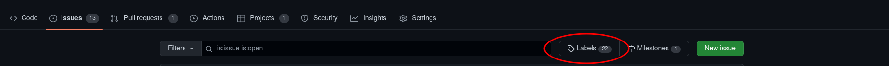
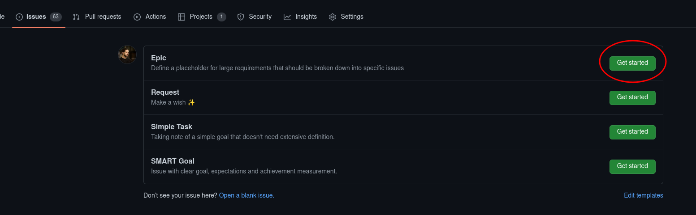

# Create and manage "Epics"

An "Epic" is a specific type of GitHub issue, used to describe and track some large requirements that should be broken down into specific issues, using:

- a dedicated issue label
- a dedicated issue template
- GitHub [Task Lists](https://docs.github.com/en/issues/tracking-your-work-with-issues/about-task-lists)

## List Epics

All epic issues are associated with an "epic" label.

To see all existing Epics in a project, you can:

- open `https://github.com/blindnet-io/<PROJECT>/labels/epic`
- go to `"Issues" Tab` > `Labels` > click on the `Epic` label

> ⚠️ **ALWAYS** verify there isn't a pre-existing similar Epic before creating a new one.

## Create an "Epic" issue

In a blindnet repository with the right issue templates, clicking on the "new issue" button should lead you to the following choice:

Select "Epic" and follow the instructions.

## Sub-Tasks (GitHub Task List)

The first goals of an Epic issue are:

- to group several issues to help better track them together
- (or) to break down a complexe goal in smaller issues

An Epic description should therefor always include a "Sub-tasks" section, where each subtask is (or will be) associated with a dedicated "classic" issue.

> 🛑 **These sub-tasks are represented using GitHub Task List.**
>
> **Please read the [associated documentation](https://docs.github.com/en/issues/tracking-your-work-with-issues/about-task-lists).**

### Wording

A Task List item can be transformed in an issue by just clicking on a dedicated <svg version="1.1" width="16" height="16" viewBox="0 0 16 16" class="octicon octicon-issue-opened" aria-label="The issue opened icon" role="img"><path d="M8 9.5a1.5 1.5 0 100-3 1.5 1.5 0 000 3z"></path><path fill-rule="evenodd" d="M8 0a8 8 0 100 16A8 8 0 008 0zM1.5 8a6.5 6.5 0 1113 0 6.5 6.5 0 01-13 0z"></path></svg> button.

When doing so, the associated text is used to define the title of the new issue.

You should therefore always try to keep a task list element as simple as possible, like you would do for an issue title. Avoid tagging people, other issues, etc. as much as possible. If you feel like you need to do so, there is a good chance you just need to convert this item to an issue.
