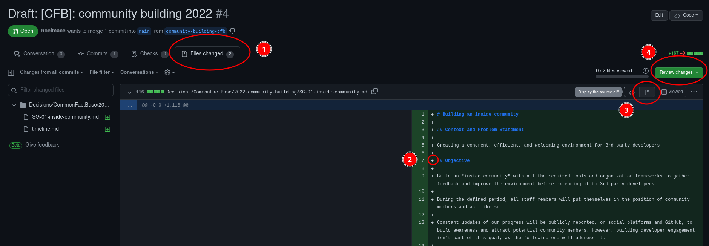

# How To Review

> See [Github documentation - reviewing changes in pull requests](https://docs.github.com/en/pull-requests/collaborating-with-pull-requests/reviewing-changes-in-pull-requests/) for more information

1. select the `files changes` tab to see what this pull request propose to change
2. comment specific lines by clicking on the corresponding  `+` sign
3. click `display the rich diff` to see how a markdown file would render
4. when you're done, click on `review changes` to finish the review (add a global comment, and say if you are just commenting, approving the modifications, or requesting changes)

You can also just add comments like this one to discuss this PR in general, but they won't be associated with a review.